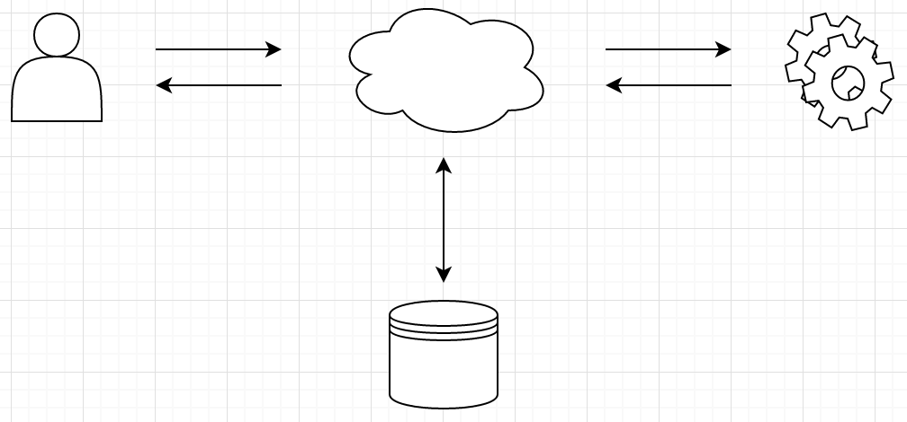

# Hypernova

> A service for server-side rendering your JavaScript views

[](https://gitter.im/airbnb/hypernova?utm_source=badge&utm_medium=badge&utm_campaign=pr-badge&utm_content=badge)

[](http://badge.fury.io/js/hypernova)
[](http://travis-ci.org/airbnb/hypernova)
[](https://david-dm.org/airbnb/hypernova)

## Why?

First and foremost, server-side rendering is a better user experience compared to just client-side rendering. The user gets the content faster, the webpage is more accessible when JS fails or is disabled, and search engines have an easier time indexing it.

Secondly, it provides a better developer experience. Writing the same markup twice both on the server in your preferred templating library and in JavaScript can be tedious and hard to maintain. Hypernova lets you write all of your view code in a single place without having to sacrifice the user‘s experience.

## How?



1. A user requests a page on your server.
1. Your server then gathers all the data it needs to render the page.
1. Your server uses a Hypernova client to submit an HTTP request to a Hypernova server.
1. Hypernova server computes all the views into an HTML string and sends them back to the client.
1. Your server then sends down the markup plus the JavaScript to the browser.
1. On the browser, JavaScript is used to progressively enhance the application and make it dynamic.

## Terminology

* **hypernova/server** - Service that accepts data via HTTP request and responds with HTML.
* **hypernova** - The universal component that takes care of turning your view into the HTML structure it needs to server-render. On the browser it bootstraps the server-rendered markup and runs it.
* **hypernova-${client}** - This can be something like `hypernova-ruby` or `hypernova-node`. It is the client which gives your application the superpower of querying Hypernova and understanding how to fallback to client-rendering in case there is a failure.

## Get Started

First you‘ll need to install a few packages: the server, the browser component, and the client. For development purposes it is recommended to install either alongside the code you wish to server-render or in the same application.

From here on out we‘ll assume you‘re using [`hypernova-ruby`](https://github.com/airbnb/hypernova-ruby) and `React` with [`hypernova-react`](https://github.com/airbnb/hypernova-react).

### Node

```sh
npm install hypernova --save
```

This package contains both the server and the client.

Next, lets configure the development server. To keep things simple we can put the configuration in your root folder, it can be named something like `hypernova.js`.

```js
var hypernova = require('hypernova/server');

hypernova({
  devMode: true,

  getComponent(name) {
    if (name === 'MyComponent.js') {
      return require('./app/assets/javascripts/MyComponent.js');
    }
    return null;
  },

  port: 3030,
});
```

Only the `getComponent` function is required for Hypernova. All other configuration options are optional. [Notes on `getComponent` can be found below](#getcomponent).

We can run this server by starting it up with node.

```sh
node hypernova.js
```

If all goes well you should see a message that says "Connected". If there is an issue, a stack trace should appear in `stderr`.

### Rails

If your server code is written in a language other than Ruby, then you can build your own client for Hypernova. A [spec](docs/client-spec.md) exists and details on how clients should function as well as fall-back in case of failure.

```sh
bundle install hypernova
```

Now lets add support on the Rails side for Hypernova. First, we‘ll need to create an initializer.

`config/initializers/hypernova_initializer.rb`

```ruby
Hypernova.configure do |config|
  config.host = "localhost"
  config.port = 3030            # The port where the node service is listening
end
```

In your controller, you‘ll need an `:around_filter` so you can opt into Hypernova rendering of view partials.

```ruby
class SampleController < ApplicationController
  around_filter :hypernova_render_support
end
```

And then in your view we `render_react_component`.

```ruby
<%= render_react_component('MyComponent.js', :name => 'Hypernova The Renderer') %>
```

### JavaScript

Finally, lets set up `MyComponent.js` to be server-rendered. We will be using React to render.

```js
import React from 'react';
import { renderReact } from 'hypernova-react';

function MyComponent(props) {
  return <div>Hello, {props.name}!</div>;
}

export default renderReact('MyComponent.js', MyComponent);
```

Visit the page and you should see your React component has been server-rendered. If you‘d like to confirm, you can view the source of the page and look for `data-hypernova-key`. If you see a `div` filled with HTML then your component was server-rendered, if the `div` is empty then there was a problem and your component was client-rendered as a fall-back strategy.

If the `div` was empty, you can check `stderr` where you‘re running the node service.

## Debugging

The [developer plugin](https://github.com/airbnb/hypernova-ruby/blob/master/lib/hypernova/plugins/development_mode_plugin.rb) for [`hypernova-ruby`](https://github.com/airbnb/hypernova-ruby) is useful for debugging issues with Hypernova and why it falls back to client-rendering. It‘ll display a warning plus a stack trace on the page whenever a component fails to render server-side.

You can install the developer plugin in `examples/simple/config/environments/development.rb`

```ruby
require 'hypernova'
require 'hypernova/plugins/development_mode_plugin'

Hypernova.add_plugin!(DevelopmentModePlugin.new)
```

You can also check the output of the server. The server outputs to `stdout` and `stderr` so if there is an error, check the process where you ran `node hypernova.js` and you should see the error.

## Deploying

The recommended approach is running two separate servers, one that contains your server code and another that contains the Hypernova service. You‘ll need to deploy the JavaScript code to the server that contains the Hypernova service as well.

Depending on how you have `getComponent` configured, you might need to restart your Hypernova service on every deploy. If `getComponent` caches any code then a restart is paramount so that Hypernova receives the new changes. Caching is recommended because it helps speed up the service.

## FAQ

> Isn‘t sending an HTTP request slow?

There isn‘t a lot of overhead or latency, especially if you keep the servers in close proximity to each other. It‘s as fast as compiling many ERB templates and gives you the benefit of unifying your view code.

> Why not an in-memory JS VM?

This is a valid option. If you‘re looking for a siloed experience where the JS service is kept separate, then Hypernova is right for you. This approach also lends itself better to environments that don‘t already have a JS VM available.

> What if the server blows up?

If something bad happens while Hypernova is attempting to server-render your components it‘ll default to failure mode where your page will be client-rendered instead. While this is a comfortable safety net, the goal is to server-render every request.

## Pitfalls

These are pitfalls of server-rendering JavaScript code and are not specific to Hypernova.

* You‘ll want to do any DOM-related manipulations in `componentDidMount`. `componentDidMount` runs
  on the browser but not the server, which means it’s safe to put DOM logic in there.
  Putting logic outside of the component, in the constructor, or in `componentWillMount` will
  cause the code to fail since the DOM isn‘t present on the server.

* It is recommended that you run your code in a VM sandbox so that requests get a fresh new
  JavaScript environment. In the event that you decide not to use a VM, you should be aware that
  singleton patterns and globals run the risk of leaking memory and/or leaking data
  between requests. If you use `createGetComponent` you’ll get VM by default.

## Clients

See [clients.md](docs/clients.md)

## Browser

The included browser package is a barebones helper which renders markup on the server and then loads it on the browser.

List of compatible browser packages:

* [`hypernova-react`](https://github.com/airbnb/hypernova-react).

## Server

Starting up a Hypernova server

```js
import hypernova from 'hypernova/server';

hypernova({
  getComponent: require,
});
```

Options, and their defaults

```js
{
  // the limit at which body parser will throw
  bodyParser: {
    limit: 1024 * 1000,
  },
  // disables cluster mode and reloads each component every time it is requested
  devMode: false,
  // how components will be retrieved,
  getComponent: undefined,
  // configure the logger
  logger: {},
  // the port the app will start on
  port: 8080,
  // whether or not to run in parallel using all available cpus
}
```

#### `getComponent`

This lets you provide your own implementation on how components are retrieved.

The most common use-case would be to use a VM to keep each module sandboxed between requests. You can use `createGetComponent` from Hypernova to retrieve a `getComponent` function that does this.

`createGetComponent` receives an Object whose keys are the component‘s registered name and the value is the absolute path to the component.

```js
import path from 'path';

hypernova({
  getComponent: createGetComponent({
    MyComponent: path.resolve(path.join('app', 'assets', 'javascripts', 'MyComponent.js')),
  }),
});
```

The simplest `getComponent` would be to use `require`. One drawback here is that your components would be cached between requests and thus could leak memory and/or data. Another drawback is that the files would have to exist relative to where this require is being used.

```js
hypernova({
  getComponent: require,
});
```

You can also fetch components asynchronously if you wish, and/or cache them. Just return a `Promise` from `getComponent`.

```js
hypernova({
  getComponent(name) {
    return promiseFetch('https://MyComponent');
  },
});
```

## API

### Browser

#### load

```typescript
type DeserializedData = { [x: string]: any };
type Node = { node: HTMLElement, data: DeserializedData };

function load(name: string): Node {}
```

Looks up the server-rendered DOM markup and its corresponding `script` JSON payload and returns it.

#### serialize

```typescript
type DeserializedData = { [x: string]: any };

function serialize(name: string, html: string, data: DeserializedData): string {}
```

Generates the markup that the browser will need to bootstrap your view on the browser.

#### toScript

```typescript
type DeserializedData = { [x: string]: any };

function toScript(attr: string, key: string, props: DeserializedData): string {}
```

An interface that allows you to create extra `script` tags for loading more data on the browser.

#### fromScript

```typescript
type DeserializedData = { [x: string]: any };

function fromScript(attr: string, key: string): DeserializedData {}
```

The inverse of `toScript`, this function runs on the browser and attempts to find and `JSON.parse` the contents of the server generated script.

### Server

#### [createGetComponent](src/createGetComponent.js)

```typescript
type Files = { [key: string]: string };
type VMOptions = { cacheSize: number, environment?: () => any };
type GetComponent = (name: string) => any;

function createGetComponent(files: Files, vmOptions: VMOptions): GetComponent {}
```

Creates a `getComponent` function which can then be passed into Hypernova so it knows how to retrieve your components. `createGetComponent` will create a VM so all your bundles can run independently from each other on each request so they don‘t interfere with global state. Each component is also cached at startup in order to help speed up run time. The files Object key is the component‘s name and its value is the absolute path to the component.

#### [createVM](src/createVM.js)

```typescript
type VMOptions = { cacheSize: number, environment?: () => any };
type Run = (name: string, code: string) => any;
type VMContainer = { exportsCache: any, run: Run };

function createVM(options: VMOptions): VMContainer {}
```

Creates a VM using Node‘s [`vm`](https://nodejs.org/api/vm.html) module. Calling `run` will run the provided code and return its `module.exports`. `exportsCache` is an instance of [`lru-cache`](https://github.com/isaacs/node-lru-cache).

#### [getFiles](src/getFiles.js)

```typescript
function getFiles(fullPathStr: string): Array<{name: string, path: string}> {}
```

A utility function that allows you to retrieve all JS files recursively given an absolute path.

#### [Module](src/Module.js)

`Module` is a class that mimics Node‘s [`module`](https://github.com/nodejs/node/blob/master/lib/module.js) interface. It makes `require` relative to whatever directory it‘s run against and makes sure that each JavaScript module runs in its own clean sandbox.

#### [loadModules](src/loadModules.js)

```typescript
function loadModules(require: any, files: Array<string>): () => Module? {}
```

Loads all of the provided files into a `Module` that can be used as a parent `Module` inside a `VM`. This utility is useful when you need to pre-load a set of shims, shams, or JavaScript files that alter the runtime context. The `require` parameter is Node.js’ `require` function.
